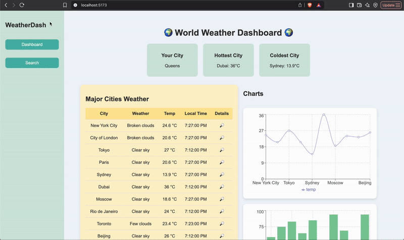

# 🌍 WeatherDash - World Weather Dashboard

WeatherDash is a React application that displays weather data for major cities using the Weatherbit API. Users can view summary statistics, browse a dynamic list of cities, and search/filter through the dataset.

---

## ✅ Required Features Checklist

- ✅ **Dashboard displaying data fetched via API call**  
  The application fetches weather data from the Weatherbit API.

- ✅ **Dashboard displays at least 10 unique items, one per row**  
  The dashboard shows weather details for over 10 major cities, with each city represented on its own row.

- ✅ **Each row includes at least two features**  
  Each row shows:
  - City name
  - Weather description
  - Temperature (°C)
  - Local time

- ✅ **useEffect React hook and async/await are used**  
  Data fetching utilizes `useEffect` and `async/await` to handle asynchronous API calls.

- ✅ **Dashboard includes at least three summary statistics about the data**  
  - User's current city (via IP lookup)
  - Hottest city (highest temperature among the listed cities)
  - Coldest city (lowest temperature among the listed cities)

- ✅ **A search bar allows the user to search for an item in the fetched data**  
  A search input allows users to search by city name.

- ✅ **The search bar correctly filters items in the list, only displaying items matching the search query**  
  As the user types, the displayed list updates dynamically to show only matching cities.

- ✅ **The dashboard list dynamically updates as the user adjusts the filter**  
  Search updates dynamically without page reload.

---

## 🎥 GIF Demo

